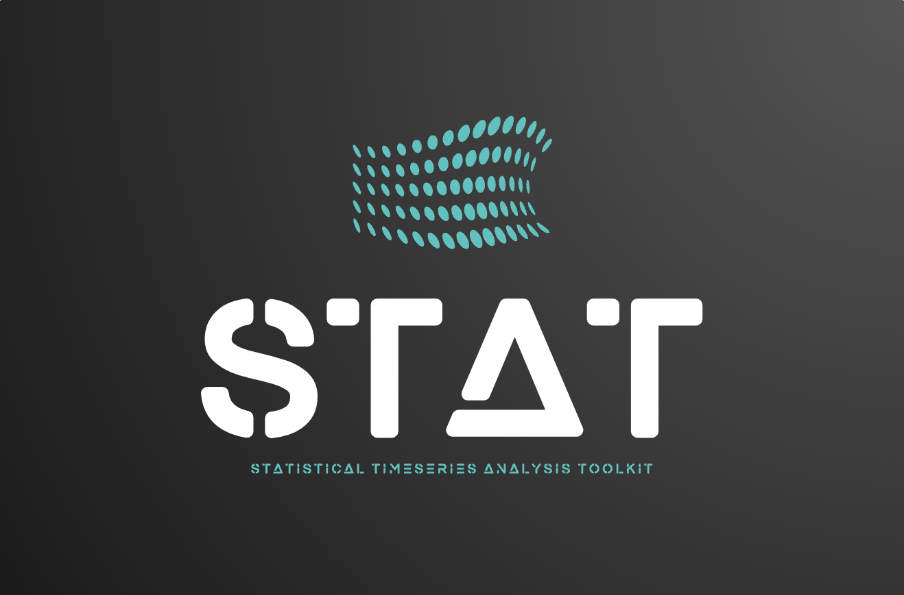

# STAT - Statistical Time Series Analysis Toolkit

## Introduction

### About STAT

Welcome to STAT, your go-to toolkit for analyzing and interpreting biomedical time-series data. From cardiac rhythms to muscle activity, STAT equips researchers, healthcare professionals, and engineers with powerful tools to uncover insights and address challenges in biomedical signal analysis.

### Key Features

- 🎯 **Comprehensive Signal Support:** Analyze ECG, EMG, EEG, and more.
- 🚀 **User-Friendly Pipelines:** Quickly apply and test workflows.
- 📊 **Advanced Visualizations:** Generate plots and visual summaries.
- 🔧 **Customizable Workflows:** Save reusable workflows for ongoing projects.
- ✨ **Built-In Filters:** Apply denoising and preprocessing methods easily.

### Why STAT?

Biomedical signals hold the key to understanding the human body. However, they often come with challenges such as noise and artifacts. STAT provides robust solutions to tackle these problems, enabling clear and actionable insights.

[Explore Supported Signals](#supported-signals)

---

## Table of Contents

- [Challenges with Biomedical Signals](#challenges-with-biomedical-signals)
- [Solutions for Signal Challenges](#solutions-for-signal-challenges)
- [Available Pipelines](#available-pipelines)
- [How to Use STAT](#how-to-use-stat)

---

## Challenges with Biomedical Signals

### Supported Biomedical Signals

#### ECG (Electrocardiogram)

Measures electrical heart activity, diagnosing conditions like arrhythmias.

**Challenges:**

- Baseline wander
- Powerline interference
- Motion artifacts
- Muscle noise

[Learn More](https://en.wikipedia.org/wiki/Electrocardiography)

#### EMG (Electromyography)

Records muscle activity, useful for diagnosing nerve disorders.

**Challenges:**

- Cross-talk
- Motion artifacts
- Powerline noise
- Electrode variability

[Learn More](https://en.wikipedia.org/wiki/Electromyography)

#### EEG (Electroencephalogram)

Monitors brain activity, aiding in epilepsy and sleep disorder diagnoses.

**Challenges:**

- Eye blink artifacts
- Muscle interference
- Environmental noise
- Electrode impedance

[Learn More](https://en.wikipedia.org/wiki/Electroencephalography)

---

## Solutions for Signal Challenges

### Signal-Specific Solutions

#### ECG Solutions

- **Baseline Wander Removal:** High-pass filters
- **Powerline Noise:** Notch filters
- **Motion Artifacts:** Adaptive filtering
- **Muscle Noise Suppression:** Wavelet denoising

#### EMG Solutions

- **Cross-Talk Reduction:** Spatial filtering
- **Motion Artifact Removal:** ICA
- **Powerline Noise Filtering:** Band-stop filters

#### EEG Solutions

- **Eye Blink Artifact Removal:** Automated detection
- **Environmental Noise Suppression:** Enhanced SNR

---

## Available Pipelines

### ECG Pipelines

1. **Baseline Wander Removal**
   - Input: ECG signal with noise
   - Steps:
     - High-pass filter
     - Notch filter
   - Output: Clean ECG signal

2. **Motion Artifact Removal**
   - Input: ECG with motion noise
   - Steps:
     - Adaptive filtering
   - Output: Enhanced ECG signal

[Learn More](#)

---

## How to Use STAT

1. Select your signal type (ECG, EMG, EEG).
2. Choose a pipeline based on challenges.
3. Process and visualize using STAT.

---
