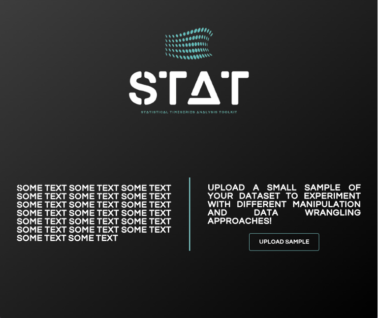
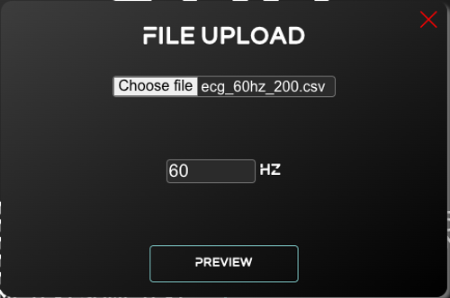
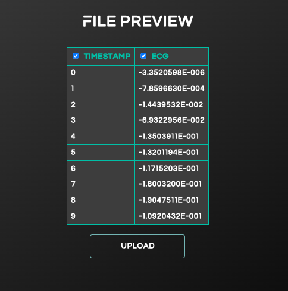
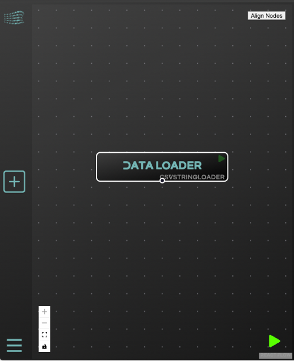
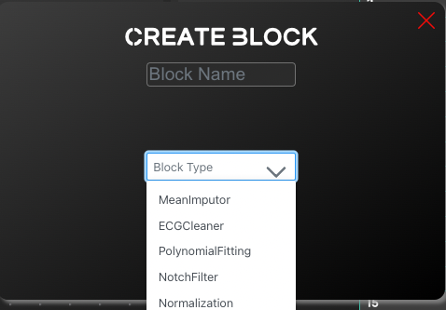
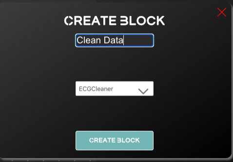
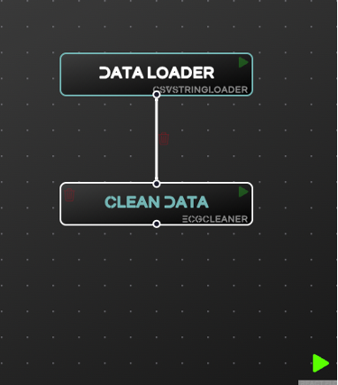
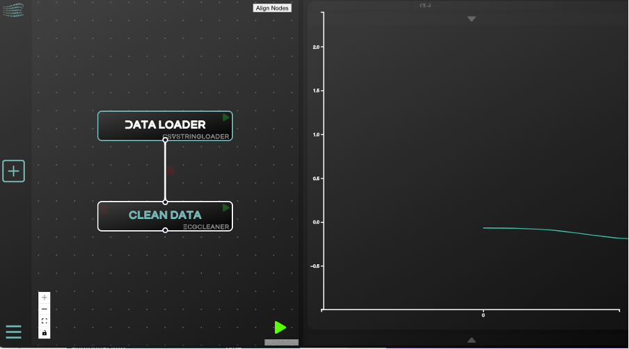
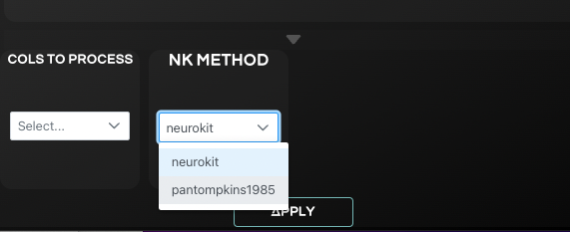

# User Stories
## Preface
This document describes all the supported operations that a user is able to perform with STAT preprocessing analysis tool. 
`Each scenario listed below, is linked with the respective user story, described in the STAT_UserStories requirement file.`

## Content Table
- [000 - Provide Input Data](#000---provide-input-data)
- [002 - Choose pre-processing steps](#002---choose-pre-processing-steps)
- [002.5 – Create and apply new transformation step](#0025--create-and-apply-new-transformation-step)
- [003 - Visual pipeline for all the preprocessing steps](#003---visual-pipeline-for-all-the-preprocessing-steps)

## Stories
### 000 - Provide Input Data
As a user, I want to upload my data through the UI, allowing me to review and select specific columns (parameters) of this dataset before applying preprocessing steps.

#### Prerequisites
Knowing the address where the application is hosted, e.g http://localhost:3000

#### Steps
1.	Access the application via a browser. 
2.	Click on UPLOAD SAMPLE button.

3.	On the pop up window, click ‘Choose File’
4.	Use your file system browser to find the relevant CSV file
5.	Provide the Dataset's Recording frequency in HZ

6.	Click Preview
7.	Examine the CSV Rows and Columns, select the columns useful for your research.

8.	Click Upload

This series of steps will result in the creation of a new pipeline, which will be incorporate the selected dataset.

### 002 - Choose pre-processing steps
Based on the selected signal, I want to see a list of pre-processing steps I could apply on the provided signal so that I can create a pipeline of pre-processing steps.

#### Prerequisites
[000 – Provide Input Data](#000---provide-input-data)

#### Steps
1. After sucessfully loading your data, you see on your screen the main interface of the application. On the left part of your screen is the pipeline visualization and the control panel of the application. Click on the ‘PLUS SIGN’ button, with the intention to create a new block in the pipeline.

2.	All the available transformations are listed In the CREATE BLOCK pop-up.

### 002.5 – Create and apply new transformation step
I want to create a new transformation step as a new block in my pipeline and see the results of my newly created transformation.

#### Prerequisites
[002 - Choose pre-processing steps](#002---choose-pre-processing-steps)

#### Steps
1.	Choose the desired transformation from the list, provide a name for the transformation, and click on Create Block button.

2.	Connect the new block by dragging your mouse, to it’s parent block. The pipeline allows you to decide which is the parent block, it could be the initial block containining the original dataset, or another block which implements another transformation. A parent block could also lead to more than one child blocks, allowing a tree structure in the pipeline.
3.	Execute the pipeline by clicking on the Green button in the bottom right, in order to get visual feed back for our transformation

### 003 - Visual pipeline for all the preprocessing steps
As a user, I want to see the pipeline view as I incorporate the pre-processing steps. I want to experiment with any input parameters of these pre-processing steps too.
#### Prerequisites
[002.5 - Create and apply new transformation step](#0025--create-and-apply-new-transformation-step)

Steps
1.	Review the pipeline blocks in the right panel.
2.	Make sure that the appropriate block is selected.
3.	Expand the PARAMETERS VIEW (bottom right arrow) 

4.	Review the Block parameters
5.	Make changes in the selections, click APPLY , and visually review the change

